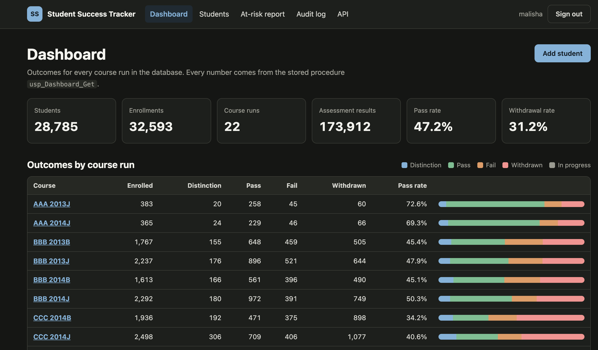
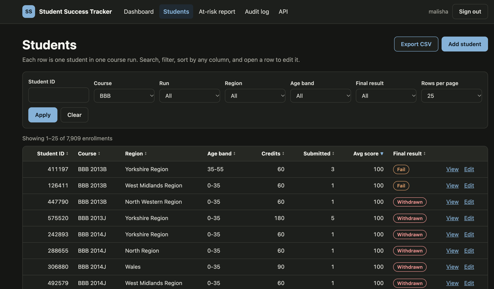
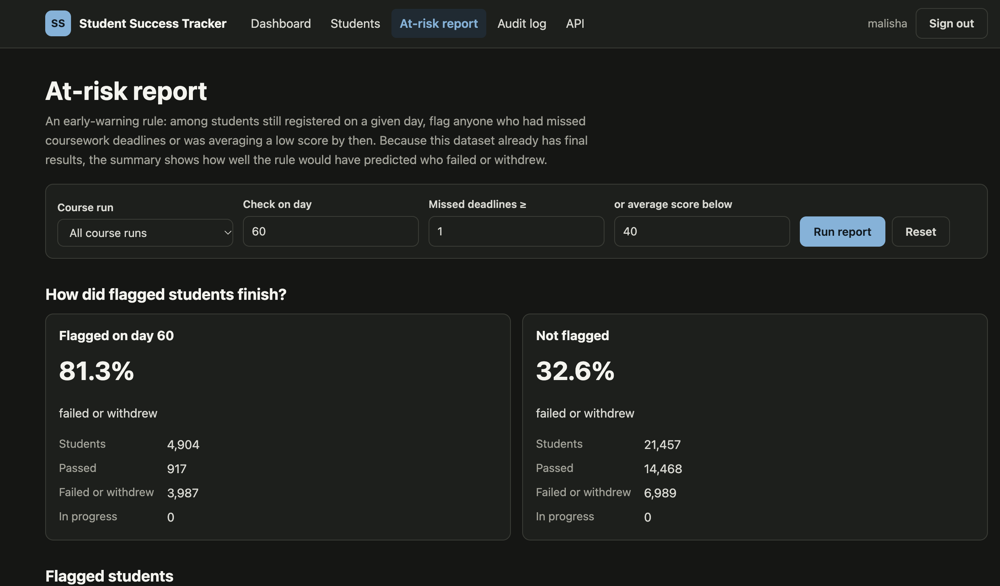
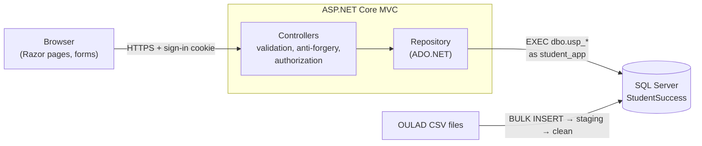
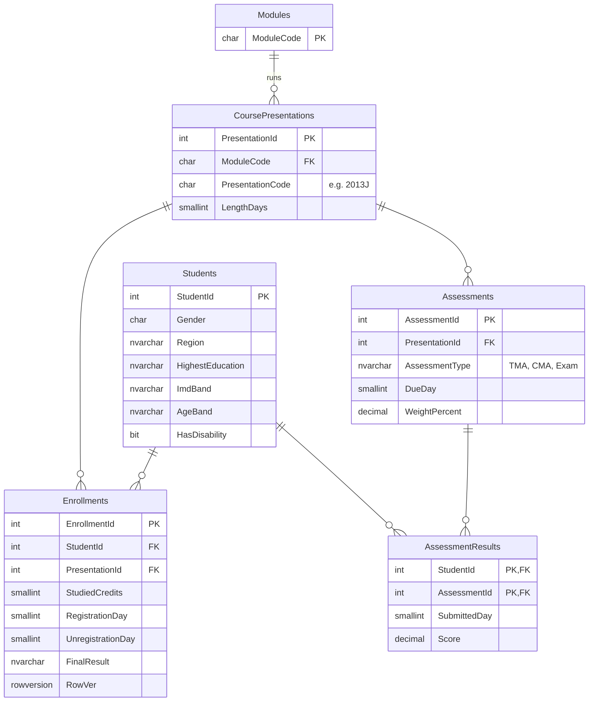
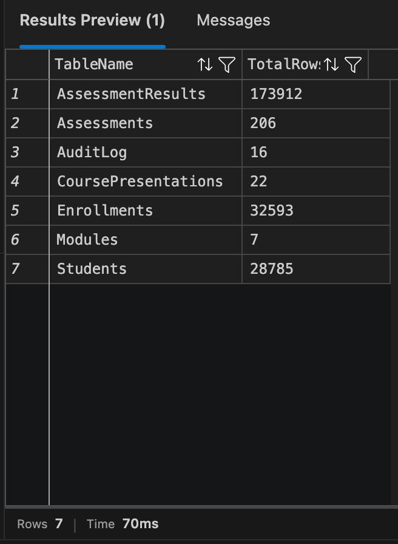
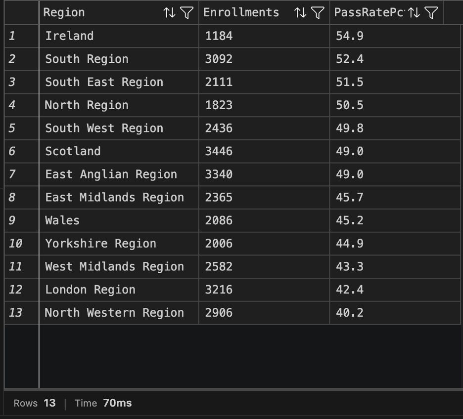
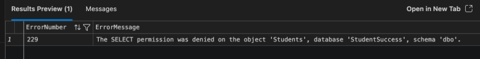

# Student Success Tracker


Built by **Malisha Islam Tapotee** · [Portfolio](https://malishaislam.github.io/)

A web application for student-support staff, built on **SQL Server** and **ASP.NET Core MVC**.
It loads 32,000+ anonymised enrollment records (about 28,800 students) from the
[Open University Learning Analytics Dataset](https://archive.ics.uci.edu/dataset/349/open+university+learning+analytics+dataset)
and lets signed-in staff search, filter, sort, add, edit and delete records, record assessment
scores, see course outcomes, and run an early-warning report of students at risk of failing.

**Stack:** C# · ASP.NET Core 10 MVC (Razor views) · SQL Server 2022 (T-SQL, stored procedures) ·
ADO.NET · HTML/CSS/JavaScript · Docker · xUnit · GitHub Actions ·
VS Code with the SQL Server (mssql) extension

## Screenshots

| Dashboard | Students | At-risk report |
|---|---|---|
|  |  |  |

## Features

| Page | What it does |
|---|---|
| **Dashboard** | Totals, pass and withdrawal rates, and a results breakdown for each of the 22 course runs |
| **Students** | Search by student ID; filter by course, run, region, age band and final result; sort by any column; page through results; export the current view to CSV |
| **Student details** | Demographics, enrollment, every assessment with the student's score; add, change or remove a score |
| **Add / Edit / Delete** | Validated forms; edits detect if someone else changed the record first; deletes remove dependent results in one transaction |
| **At-risk report** | Flags students who, by a chosen day, had missed coursework deadlines or were averaging a low score, and shows how flagged students actually finished |
| **Audit log** | Who changed what and when, written in the same transaction as each change |
| **JSON API** | Read-only endpoints for search, details, dashboard and at-risk data, with interactive docs |

## Architecture



The app never sends SQL text against tables: every operation is a stored procedure, and the
app's database login (`student_app`) can only `EXECUTE` procedures.

## Database



Plus an `AuditLog` table. Rows loaded from the dataset: about 28,800 students, 32,600 enrollments,
206 assessments and 173,900 results.

| Script | Purpose |
|---|---|
| [`01_schema.sql`](database/01_schema.sql) | Tables with primary/foreign keys, unique and check constraints, indexes, a `rowversion` column |
| [`02_procedures.sql`](database/02_procedures.sql) | 12 stored procedures: search with whitelisted sorting and `OFFSET/FETCH` paging, multi-result-set reads, transactional create/update/delete with audit logging, reporting |
| [`03_import.sql`](database/03_import.sql) | `BULK INSERT` of the CSVs into a staging schema, then cleaning, type conversion, de-duplication and loading in one transaction |
| [`04_security.sql`](database/04_security.sql) | The EXECUTE-only `student_app` login |
| [`examples.sql`](database/examples.sql) | Queries to explore the data by hand in VS Code, including tests that `student_app` cannot read or change tables directly |

### SQL Server in action

Queries run in VS Code (SQL Server extension) against the running database.

Every table and its row count after importing the dataset:



Pass rate by region, using a join and grouping:



Least privilege: acting as the app's login (`student_app`), a direct `SELECT` on a table is refused
with error 229. The app can still add, edit and delete records, but only through the stored procedures:



---

## Run it (macOS)

**Needs:** [Docker Desktop](https://www.docker.com/products/docker-desktop/). On Apple Silicon, turn on
*Settings → General → "Use Rosetta for x86_64/amd64 emulation on Apple Silicon"* and give Docker at
least 4 GB of memory (*Settings → Resources*).

```bash
bash scripts/get-data.sh        # downloads the dataset (about 45 MB) into ./data
cp .env.example .env            # then edit the four values in .env
docker compose up --build
```

The first start creates the database and imports the CSV files, which takes a minute or two.
When the log shows `Database is ready.` and `Now listening on: http://[::]:8080`, open:

| URL | What |
|---|---|
| http://localhost:5080 | The app (sign in with `ADMIN_USERNAME` / `ADMIN_PASSWORD` from `.env`) |
| http://localhost:5080/docs.html | Interactive API docs (sign in first) |
| http://localhost:5080/health | Health check, including the database connection |

Check everything end to end from a second terminal:

```bash
bash scripts/smoke-test.sh
```

**Your data is kept** between restarts, including changes made in the app. To start over from the CSV files:

```bash
docker compose run --rm -e RESET_DB=1 db-init
```

To stop: `Ctrl+C`, or `docker compose down`. To delete everything including the database: `docker compose down -v`.

### Look inside the database with VS Code

1. Install the **SQL Server (mssql)** extension (VS Code recommends it when you open this folder).
2. Press **⌘ Shift P**, run **MS SQL: Add Connection**, and enter:

   | Field | Value |
   |---|---|
   | Server name | `localhost,1433` |
   | Authentication type | SQL Login |
   | User name | `sa` |
   | Password | `SA_PASSWORD` from `.env` |
   | Database name | `StudentSuccess` |
   | Trust server certificate | ticked (Encrypt: Optional) |

3. Open [`database/examples.sql`](database/examples.sql), highlight one block and click **Run** (▷).

`sa` is the administrator, so it can change tables directly, but direct changes skip the checks and
the audit log. Use the app (or the stored procedures, as in section 7 of `examples.sql`) to change data.

### Develop without rebuilding the container

With the [.NET 10 SDK](https://dotnet.microsoft.com/download) installed:

```bash
docker compose up -d sqlserver db-init
cd src/StudentSuccess.Web
dotnet user-secrets set "ConnectionStrings:StudentSuccess" "Server=localhost,1433;Database=StudentSuccess;User Id=student_app;Password=<APP_DB_PASSWORD>;TrustServerCertificate=True"
dotnet user-secrets set "Auth:Password" "<a password>"
dotnet run                      # http://localhost:5090
cd ../.. && dotnet test         # unit tests
```

---

## Security

- **SQL injection:** values are always typed parameters to stored procedures. Sorting uses a fixed whitelist inside the procedure, not dynamic SQL.
- **Least privilege:** the app's database login can only execute procedures; it can't read tables directly or change the schema.
- **Authentication:** every page and API endpoint requires sign-in (cookie, HttpOnly, SameSite=Strict). Passwords are compared in constant time, and sign-in is rate-limited to 5 attempts per minute per address.
- **CSRF:** every form submission must carry an anti-forgery token.
- **Validation twice:** in C# (shown next to each field) and again in the procedures.
- **Conflicting edits:** a `rowversion` check stops one person silently overwriting another's changes.
- **Output safety:** Razor encodes all output; CSV export neutralises spreadsheet formulas (CSV injection).
- **No leaked internals:** unexpected errors show a generic page; SQL and stack traces stay in the server log.
- **Headers:** Content-Security-Policy (no inline scripts), `X-Frame-Options`, `X-Content-Type-Options`.
- **Secrets:** in `.env` (git-ignored) or `dotnet user-secrets`, never in source. The container runs as a non-root user.
- **Privacy:** the dataset is anonymised; the app is designed as if records were real (sign-in required, audit trail).

## Accessibility

Semantic HTML with labelled form fields, error summaries that receive focus, `aria-invalid` on invalid
fields, sortable column headers that announce their state (`aria-sort`), a skip link, visible focus
outlines, keyboard-only operation, sufficient colour contrast in light and dark themes, and layouts
that work on a phone.

## Testing

| Layer | Where | What |
|---|---|---|
| Unit tests | [`tests/StudentSuccess.Tests`](tests/StudentSuccess.Tests) | Search normalisation, paging, form validation, CSV escaping, sign-in, error mapping, and controller flows (add, edit, conflict, delete, scores, export) against an in-memory repository |
| End-to-end | [`scripts/smoke-test.sh`](scripts/smoke-test.sh) | 38 checks against the running app and database: sign-in, every page, filters, sorting, paging, export, add, edit, conflict detection, scores, delete, audit, sign-out |
| CI | [`.github/workflows/ci.yml`](.github/workflows/ci.yml) | On every push: build and unit tests, then a real SQL Server container, the full import (using the synthetic data in [`sample-data/`](sample-data)) and the end-to-end test |

## Project structure

```
database/            T-SQL: schema, stored procedures, CSV import, security, examples
src/StudentSuccess.Web/
  Controllers/       MVC controllers and the JSON API
  Data/              Repository (ADO.NET + stored procedures), SQL error mapping
  Models/            Records, search/filter model, validated forms
  Infrastructure/    Sign-in, security headers, rate limiting, CSV export, error handling
  Views/             Razor pages
  wwwroot/           CSS, JavaScript, API docs page
tests/               xUnit tests and an in-memory repository
scripts/             get-data, init-db, smoke-test
sample-data/         Small synthetic CSVs in the dataset's format (used by CI)
docs/WALKTHROUGH.md  How a request moves through the code
docs/images/         Screenshots used in this README
.vscode/             Recommends the SQL Server (mssql) extension
```

## Data and licence

Kuzilek, J., Hlosta, M. & Zdrahal, Z. (2017). *Open University Learning Analytics dataset.*
Scientific Data 4, 170171. https://doi.org/10.1038/sdata.2017.171 — licensed
[CC BY 4.0](https://creativecommons.org/licenses/by/4.0/). The dataset is not included in this
repository; `scripts/get-data.sh` downloads it.
